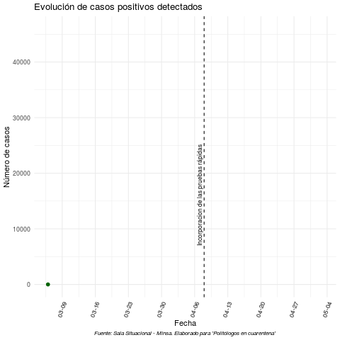

```{r setup, include=FALSE}
knitr::opts_chunk$set(echo = TRUE)
```

```{r, include=FALSE}
# instalar paquetes
#install.packages("tidyverse")
library(tidyverse)
#install.packages("ggplot")
library(ggplot2)
#install.packages("gifski")
library(gifski)
#install.packages("gganimate")
library(gganimate)
#install.packages("plotly")
library(plotly)
#install.packages("dplyr")
library(dplyr)
```

```{r,include=FALSE}

### Cargar la data

casosperu="https://docs.google.com/spreadsheets/d/e/2PACX-1vRJsBU46m84Yl8hUIo5c1fILeYqcSa4vDXhFyIQ_QbUJndBfLLO-N4nkHOfl5hgZMWKzv1L73oiqwzm/pub?gid=1165383620&single=true&output=csv"

casos=as.data.frame(read.csv(casosperu,header=T))

### Lectura adecuada
casos$casos_positivos<-as.numeric(casos$casos_positivos)
casos$dia<-as.Date(casos$dia)
```

###  Introducción  

<p>
<div style="text-align:justify"> El dia **06 de marzo del 2020** se registró el primer caso de coronavirus en el Perú. Fueron tomadas las medidas iniciales y el dia 15 de marzo se anuncio el inicio del Estado de Emergencia Nacional junto con la medida de Aislamiento Social Obligatorio, para esa fecha se habian registrado 71 casos positivos. Al finalizar el mes de marzo se registraron 1065 nuevos casos. Un mes después se habián pasado los 36 mil casos. </div>
</p>

<p>
En ese sentido, esta sección tiene por objetivo responder a la pregunta **¿Cómo se ha desarrollado la propagación del COVID-19 en el Perú?**
</p>

### 1.1. Evolución de los casos positivos detectados


```{r, echo=FALSE,eval=TRUE, message=FALSE}
g1<-casos %>% ggplot(aes(x=dia, y=casos_positivos)) +  geom_area(fill="grey", alpha=0.4) +  geom_line(color="darkgreen", size=0.8) +  geom_point(size=2, color="darkgreen") + theme_minimal() + labs(title="Evolución de casos positivos detectados",caption = "Fuente: Sala Situacional - Minsa. Elaborado para 'Politólogos en cuarentena'" ,x = "Fecha", y="Número de casos")+ theme(plot.caption=element_text(size=8, hjust=0.5, face="italic", color="black")) + scale_x_date(date_breaks = "1 week", date_labels = "%m-%d") + theme(axis.text.x  =element_text(angle = 70, hjust = 1)) +geom_vline(aes(xintercept=(as.numeric(as.Date("2020-04-08")))),  linetype = 2) + geom_text(aes(x=(as.Date("2020-04-08")), y= 7000, label='Incorporacion de las pruebas rápidas'), size=3, angle=90, vjust=-0.4, hjust=0,color="black") + geom_text(aes(y=casos_positivos,label=casos_positivos),position=position_dodge(width = 0.9),size=2.5, vjust=-1,hjust=0.5,col="black")

g1

###Grafico gif
#casos %>% ggplot(aes(x=dia, y=casos_positivos)) +  geom_area(fill="grey", alpha=0.4) +  geom_line(color="darkgreen", size=0.8) +  geom_point(size=2, color="darkgreen") + theme_minimal() + labs(title="Evolución de casos positivos detectados",caption = "Fuente: Sala Situacional - Minsa. Elaborado para 'Politólogos en cuarentena'" ,x = "Fecha", y="Número de casos")+ theme(plot.caption=element_text(size=8, hjust=0.5, face="italic", color="black")) + scale_x_date(date_breaks = "1 week", date_labels = "%m-%d") + theme(axis.text.x  =element_text(angle = 70, hjust = 1)) +geom_vline(aes(xintercept=(as.numeric(as.Date("2020-04-08")))),  linetype = 2) + geom_text(aes(x=(as.Date("2020-04-08")), y= 7000, label='Incorporacion de las pruebas rápidas'), size=3, angle=90, vjust=-0.4, hjust=0,color="black") +transition_reveal(dia)


#ggplotly(g2, tooltip = c("dia", "casos_positivos"),height = 350, width=600)

#g1 +transition_reveal(dia)


```


<p><!-- --></p>

### 1.2. Nuevos casos positivos detectados por día

```{r, echo=FALSE,eval=TRUE, message=FALSE}
g2<-casos %>% ggplot(aes(x=dia, y=c_positivos_dia)) +  geom_area(alpha=0.1) +  geom_line(color="orange", size=0.8) +  geom_point(size=2, color="orange") + theme_classic() + labs(title="Nuevos casos positivos detectados por día",caption = "Fuente: Sala Situacional - Minsa. Elaborado para 'Politólogos en cuarentena'" ,x = "Fecha", y="Número de casos")+ theme(plot.caption=element_text(size=8, hjust=0.5, face="italic", color="black")) 

g2 + geom_text(aes(y=c_positivos_dia,label=c_positivos_dia),position=position_dodge(width = 0.9),size=2.5, vjust=-1,hjust=0.5,col="black")

#ggplotly(g2, tooltip = c("dia", "casos_positivos"),height = 350, width=600)

#+transition_reveal(dia)

```


### 1.3. Evolución del total de fallecimientos

```{r, echo=FALSE,eval=TRUE, message=FALSE}

### Evolucion de fallecimientos

muertos<-casos %>% ggplot(aes(x=dia, y=fallecidos_total))+ geom_line(color="black", size=0.8) +  geom_point(size=2, color="black") + theme_minimal() + labs(title= "Evolución del total de fallecimientos",x = "Fecha", y="Número de fallecidos",caption = "Fuente: Sala Situacional - Minsa. Elaborado para 'Politólogos en cuarentena'")+ theme(plot.caption=element_text(size=8, hjust=0.5, face="italic", color="black")) 

muertos + geom_text(aes(y=fallecidos_total,label=fallecidos_total),position=position_dodge(width = 0.9),size=2.5, vjust=-1,hjust=0.5,col="blue")

#ggplotly(muertos, tooltip = c("dia", "fallecidos_total"),height = 350, width=600) 

#+transition_reveal(dia)

```


```{r, include=FALSE}
#### Por lugar de fallecimiento grafico
```


### 1.4. Nuevos fallecimientos por día

```{r, echo=FALSE,eval=TRUE, message=FALSE}
g4<-casos %>% ggplot(aes(x=dia, y=fallecidos_dia)) +  geom_area(alpha=0.1) +  geom_line(color="#CC79A7", size=0.8) +  geom_point(size=2, color="#CC79A7") + theme_classic() + labs(title="Nuevos fallecimientos por día",caption = "Fuente: Sala Situacional - Minsa. Elaborado para 'Politólogos en cuarentena'" ,x = "Fecha", y="Número de casos")+ theme(plot.caption=element_text(size=8, hjust=0.5, face="italic", color="black")) 

g4 + geom_text(aes(y=fallecidos_dia,label=fallecidos_dia),position=position_dodge(width = 0.9),size=2.5, vjust=-1,hjust=0.5,col="black")

#ggplotly(g2, tooltip = c("dia", "casos_positivos"),height = 350, width=600)

#+transition_reveal(dia)

```


### 1.5. Evolución de nuevos de hospitalizados por dia

```{r, echo=FALSE, eval=TRUE}

hospital<-casos[!is.na(casos$hospital),]


hospitalizados<-hospital %>% ggplot(aes(x=dia, y=hospital))+ geom_line(color="orange", size=0.8) +  geom_point(size=2, color="orange") + theme_classic() + labs(title= "Evolución del número de hospitalizados",x = "Fecha", y="Número de hospitalizados",caption = "Fuente: Sala Situacional - Minsa. Elaborado para 'Politólogos en cuarentena'")+ theme(plot.caption=element_text(size=8, hjust=0.5, face="italic", color="black")) 

hospitalizados + geom_text(aes(y=hospital,label=hospital),position=position_dodge(width = 0.9),size=2.5, vjust=-1,hjust=0.5,col="blue")


```


### 1.6. Evolución de nuevos de hospitalizados por dia

```{r, echo=FALSE,eval=TRUE, message=FALSE, warning=FALSE}

hospital_nuevos<-casos[!is.na(casos$hospital_nuevos),]


### Evolucion de hospitalizados

g5<-hospital_nuevos %>% ggplot(aes(x=dia, y=hospital_nuevos))+ geom_line(color="grey", size=0.8) +  geom_point(size=2, color="darkgrey") + theme_classic() + labs(title= "Evolución de nuevos de nuevos hospitalizados por dia",x = "Fecha", y="Número de hospitalizados",caption = "Fuente: Reportes diarios del Minsa. Elaborado para 'Politólogos en cuarentena'")+ theme(plot.caption=element_text(size=8, hjust=0.5, face="italic", color="black")) 

g5 + geom_text(aes(y=hospital_nuevos,label=hospital_nuevos),position=position_dodge(width = 0.9),size=3, vjust=-1,hjust=0.5,col="blue")+ geom_hline(yintercept = 0)

#ggplotly(muertos, tooltip = c("dia", "fallecidos_total"),height = 350, width=600) 

#+transition_reveal(dia)

```

### 1.7. Evolución de personas en UCI 

```{r UCI, warning=FALSE, echo=FALSE,eval=TRUE}
ucidata<-casos[!is.na(casos$uci_uso),]

uci<-ucidata %>% ggplot(aes(x=dia, y=uci_uso))+ geom_line(color="blue", size=0.8) +  geom_point(size=2, color="blue") + theme_classic() + labs(title= "Evolución de personas en UCI",x = "Fecha", y="Número de personas en UCI",caption = "Fuente: Sala Situacional - Minsa. Elaborado para 'Politólogos en cuarentena'")+ theme(plot.caption=element_text(size=8, hjust=0.5, face="italic", color="black")) + geom_text(aes(y=uci_uso,label=uci_uso),position=position_dodge(width = 0.9),size=2, vjust=-2,hjust=0.5,col="black")

uci

```

### 1.8. Evolución en la disponibilidad de camas UCI 

```{r, echo=FALSE,eval=TRUE}
uci_semana=subset(casos,dia>"2020-04-20")


library(dplyr)
uci_semana%>%
  dplyr::select("Fecha"="dia","Total de camas UCI"="uci_total" ,"Camas UCI ocupadas"="uci_uso", "Camas UCI disponibles"="uci_disponibles") %>%  DT::datatable(rownames = FALSE)
```


### 1.9. Evolución de los casos positivos activos

<p>
<div style="text-align:justify"> El número de casos activos es registrada descontando de los casos confirmados al número de muertos y los pacientes recuperados. Esta cifra ha variado en la tendencia por un aumento considerable en el número de recuperados. </div>
</p>


```{r, warning=FALSE,echo=FALSE,eval=TRUE}

abril=subset(casos,dia>"2020-04-01")

g4<-abril %>% ggplot(aes(x=dia, y=casos_activos)) +  geom_area(alpha=0.1) +  geom_line(color="#56B4E9", size=0.8) +  geom_point(size=2, color="#56B4E9") + theme_classic() + labs(title="Numero de casos activos (Abril)",caption = "Fuente: Sala Situacional - Minsa. Elaborado para 'Politólogos en cuarentena'" ,x = "Fecha", y="Número de casos")+ theme(plot.caption=element_text(size=8, hjust=0.5, face="italic", color="black"))

g4 + geom_text(aes(y=casos_activos,label=casos_activos),position=position_dodge(width = 0.9),size=2.5, vjust=-1,hjust=0.5,col="black")
```


```{r pendientes, include=FALSE}
##### 1.6. Distribución de casos de COVID-19


#Entre hospitalizados, recuperados, domicilados y fallecidos en un gráfico apilado

##### 1.7. Distribución de casos de COVID-19

##### 1.8. Numero de pruebas realizadas diaria y acumulada

##### 1.9. Tasa de positivos


```


<p>
<div style="text-align:right"> Datos actualizados al 03/05/2020 </div>
</p>


