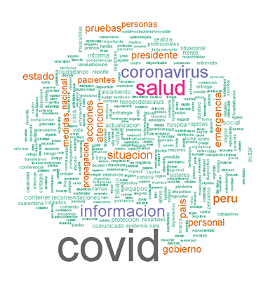
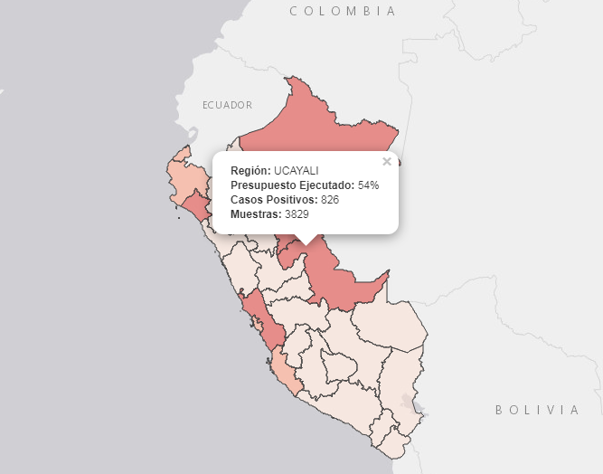

# ¿Cómo surge este portal?

<p>
<div style="text-align:justify"> Este portal es un esfuerzo conjunto para realizar un monitoreo de las decisiones políticas adoptadas por el gobierno peruano en respuesta a la pandemia del nuevo coronavirus (SARS-CoV-2). Dicho esfuerzo se complementa con la aplicación de una serie de conceptos para el estudio de políticas públicas como instrumentos de políticas, conflictividad social, redes de coordinación, agenda de problemas públicos, entre otros.     

El objetivo final es construir un repositorio de las medidas adoptadas, acciones e información durante la emergencia sanitaria para la reflexión sobre la respuesta del Estado Peruano y que sea de utilidad para estudiantes y profesionales en la elaboración de investigaciones u otros proyectos. </div>
</p>


# ¿Qué encontrarás en este portal?

[Sección 1: Evolución del COVID-19 en el Perú](https://covid-19-proyectoperu.github.io/casos.html)    

<p>
<div style="text-align:justify">Esta sección presenta una serie de indicadores para responder a la pregunta: **¿Cómo se ha desarrollado la propagación del COVID-19 en el Perú?** </div>
</p>

```{r, echo=FALSE,eval=TRUE, message=FALSE,fig.align='center', warning=FALSE}
### Cargar la data


options(scipen=999)
casosperu="https://docs.google.com/spreadsheets/d/e/2PACX-1vRJsBU46m84Yl8hUIo5c1fILeYqcSa4vDXhFyIQ_QbUJndBfLLO-N4nkHOfl5hgZMWKzv1L73oiqwzm/pub?gid=1165383620&single=true&output=csv"

casos=as.data.frame(read.csv(casosperu,header=T))

### Lectura adecuada
casos$casos_positivos<-as.numeric(casos$casos_positivos)
casos$dia<-as.Date(casos$dia)
### datos

library(dplyr)
library(ggplot2)
g2<-casos %>% ggplot(aes(x=dia, y=casos_activos))  +  geom_line(color="#ffff28", size=0.8) +  ylim(0,max(casos$casos_activos)*3)+geom_bar(fill="#42857b",aes(y=recuperados_dia),stat = "identity",width = 1) +geom_line(color="#c93c20",aes(y=c_positivos_dia))+  geom_point(size=2, aes(y=c_positivos_dia),color="#c93c20")  + 
 scale_y_log10()+ theme_classic() + labs(title="Evolución de los casos activos",caption = "Fuente: Sala Situacional - Minsa. Elaborado para 'Politólogos en cuarentena'" ,x = "Fecha", y="Número de casos")+ theme(plot.caption=element_text(size=8, hjust=0.5, face="italic", color="black")) 

g2 + geom_text(aes(y=casos_activos,label=casos_activos),position=position_dodge(width = 0.9),size=2, vjust=0,hjust=1,col="#2f4f4f", angle=-50)

```


[Sección 2: Seguimiento nacional](https://covid-19-proyectoperu.github.io/nacional.html)    

<p>
<div style="text-align:justify"> Esta sección registra la cadena de decisiones políticas adoptadas por el gobierno nacional en el contexto de la Emergencia Nacional a causa del COVID-19. Este seguimiento cuenta con temas como: trayectoria de las decisiones, instrumentos de politicas, redes de politicas, establecimiento de los problemas publicos, servidores de primera linea, eventos de protestas, pronunciamientos y demandas. </div>
</p>    

<div align="center"><!-- --></div>

[Sección 3: Seguimiento sub-nacional](https://covid-19-proyectoperu.github.io/subnacional.html)

<p>
<div style="text-align:justify"> Esta sección registra la propagación de casos positivos, muestras realizadas, ejecución de presupuesto, entre otros datos de interes desagregados a nivel de gobierno regional y municipalidades.</div>
</p>

<div align="center"></div>  
<br>    
    
## ¿Quienes somos los "Politólogos en cuarentena"?

<p>
<div style="text-align:justify"> Es un equipo formado por egresados y estudiantes interesados en la investigación sobre la respuesta del Estado Peruano desde una perspectiva de Ciencia Política. De esta manera, colaboramos en la recopilación, análisis y presentación de la información que ha venido surgiendo durante el Estado de Emergencia y la acciones emprendidas por el gobierno, actores politicos a nivel nacional y autoridades a nivel sub-nacional, tanto en el área de la salud como en las diferentes áreas de políticas públicas. </div>
</p>

Aquí pueden ver la presentación: ["Politologos en cuarentena"](https://docs.google.com/document/d/1PEbBTn_jQNJT7RUfRzYqj83U7xnT4rHn2OGpxyMYHZo/edit?usp=sharing)


### ¿Cómo sumarse al equipo?

<p>
<div style="text-align:justify"> Este portal esta abierto a toda colaboración, aquellos que tengan interes en apoyar en el seguimiento de los datos de alguna sección (datos, nacional, sub-nacional) y/o proponer agregar apartados en las secciones. Para sumarse en el proyecto pueden completar el siguiente [formulario](https://docs.google.com/forms/d/e/1FAIpQLSfEZ-eyIvOWvujmWCkyeuGLxMCREPLY-qZjh4tZQ3aZ2o1ZEA/viewform?usp=sf_link).  

Los colaboradores deben estar disponibles para la actualización constante de la información presentada en el portal.</div>
</p>

### ¿Cómo hacernos llegar tus comentarios?

<p>
<div style="text-align:justify"> Tenga en cuenta, este es un proyecto de recopilación de datos en curso. Si ve alguna inexactitud en la información proporcionada, o para comentarios específicos sobre el análisis u otro aspecto del portal, contáctenos: [**covid19.proyectoperu@gmail.com**](mailto:covid19.proyectoperu@gmail.com) </div>
</p>


