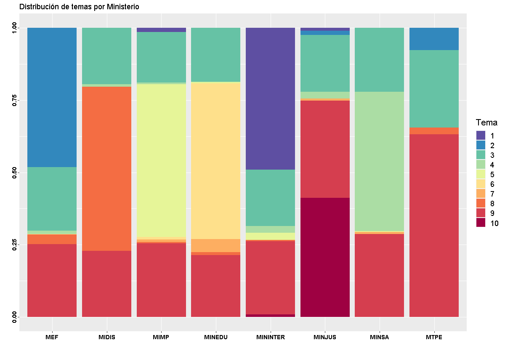
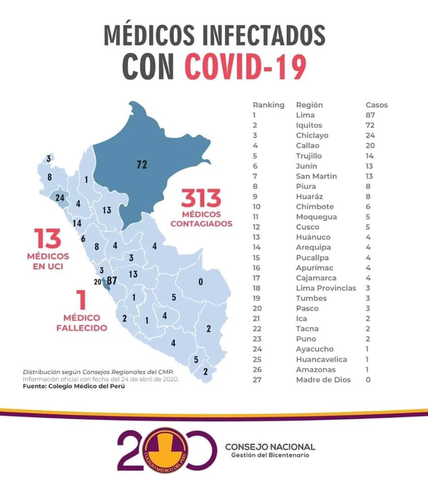

```{r paquetes, include=FALSE,warning=FALSE}
knitr::opts_chunk$set(echo = TRUE)
library(ggplot2)
library(ggiraph)
library(data.table)
library(dplyr)
library(tidygraph)
library(networkD3)
library(igraph)
library(visNetwork)
library(sp)
```


```{r cargar data, include=FALSE}
# cargar base de datos

data="https://docs.google.com/spreadsheets/d/e/2PACX-1vRJsBU46m84Yl8hUIo5c1fILeYqcSa4vDXhFyIQ_QbUJndBfLLO-N4nkHOfl5hgZMWKzv1L73oiqwzm/pub?gid=31875411&single=true&output=csv"

BD_COVID<-as.data.frame(read.csv(data))
BD_COVID$Fecha<-as.Date(BD_COVID$Fecha) # Modificar datos sobre fecha
```

###  Introducción

<p>
<div style="text-align:justify"> El objetivo del seguimiento nacional es registrar la cadena de decisiones políticas adoptadas por el gobierno nacional en el contexto de la Emergencia Nacional a causa del COVID-19. Este seguimiento cuenta con **6 secciones**: Trayectoria de las decisiones, instrumentos de politicas, redes de politicas, establecimiento de los problemas publicos, servidores de primera linea, eventos de protestas. </div>
</p>

### Trayectoria de las decisiones públicas


<p>
Para visualizar la actualización de las medidas frente al COVID-19: [Base de Seguimiento Nacional](https://docs.google.com/spreadsheets/d/1lIJ9H9M5Vd8r7pGx8nHQzzYt_VXYrEFANp2Dhe9rtT8/edit?usp=sharing)
</p>

```{r Trazabilidad de decisiones, echo=FALSE,eval=TRUE, warning=FALSE, fig.align='center'}

decisiones<-BD_COVID[!is.na(BD_COVID$Fecha),] #Excluir aquellos registros que no son decisiones públicas
decisiones=subset(decisiones,Referencia!="Informes", )
decisiones=subset(decisiones,Referencia!="Pronunciamiento", )
decisiones=subset(decisiones,Referencia!="Protesta", )
decisiones<-decisiones[!is.na(decisiones$Area),]


trazabilidad<-ggplot(decisiones, aes(x=Fecha, y=Area,color=Area)) +  geom_jitter(size=2) +   scale_x_date(date_breaks = "1 week", date_labels = "%m-%d") + theme(axis.text.x  =element_text(angle = 70, hjust = 1)) +geom_vline(aes(xintercept=(as.numeric(as.Date("2020-03-15")))),  linetype = 2) + geom_text(aes(x=(as.Date("2020-03-15")), y= "Economía y Finanzas", label='Inicio del Estado de emergencia'), size=2.8, angle=90, vjust=-0.4, hjust=0,color="black") +geom_vline(aes(xintercept=(as.numeric(as.Date("2020-03-18")))),  linetype = 2) + geom_text(aes(x=(as.Date("2020-03-18")), y= "Economía y Finanzas", label='Inmovilizacion Social Obligatoria'), size=2.8, angle=90, vjust=-0.4, hjust=0,color="black") +geom_vline(aes(xintercept=(as.numeric(as.Date("2020-03-31")))),  linetype = 2) + geom_text(aes(x=(as.Date("2020-03-31")), y= "Economía y Finanzas", label='Primera prórroga hasta el 12 de abril '), size=2.8, angle=90, vjust=-0.4, hjust=0, color="black")+geom_vline(aes(xintercept=(as.numeric(as.Date("2020-04-13")))),  linetype = 2) + geom_text(aes(x=(as.Date("2020-04-13")), y= "Economía y Finanzas", label='Segunda prórroga hasta el 26 de abril '), size=2.8, angle=90, vjust=-0.4, hjust=0, color="black") +geom_vline(aes(xintercept=(as.numeric(as.Date("2020-04-26")))),  linetype = 2) + geom_text(aes(x=(as.Date("2020-04-26")), y= "Economía y Finanzas", label='Tercera prórroga hasta el 10 de mayo '), size=2.8, angle=90, vjust=-0.4, hjust=0, color="black")+geom_vline(aes(xintercept=(as.numeric(as.Date("2020-05-10")))),  linetype = 2) + geom_text(aes(x=(as.Date("2020-05-10")), y= "Economía y Finanzas", label='Cuarta prórroga hasta el 24 de mayo '), size=2.8, angle=90, vjust=-0.4, hjust=0, color="black") +geom_vline(aes(xintercept=(as.numeric(as.Date("2020-05-24")))),  linetype = 2) + geom_text(aes(x=(as.Date("2020-05-24")), y= "Economía y Finanzas", label='Quinta prórroga hasta el 30 de junio '), size=2.8, angle=90, vjust=-0.4, hjust=0, color="black") + labs(caption = "Fuente: El Peruano, Defensoría del Pueblo. Elaborado para 'Politólogos en cuarentena'" ,x = "Fecha", y="Medidas adoptadas")+ theme(plot.caption=element_text(size=8, hjust=0.5, face="italic", color="black")) 

#axis.title.y=element_blank(),axis.text.y=element_blank(), axis.ticks.y=element_blank() ,
t1<-trazabilidad+theme(axis.title.y=element_blank(),axis.text.y=element_blank(), axis.ticks.y=element_blank(), legend.position = "left")

t1

#t2<-t1 + geom_jitter_interactive(aes(y =Area,tooltip=Area))

#girafe(code = print(t2) )
```

```{r pendiente 1,include=FALSE}
#ggplot(decisiones, aes(x=Fecha, y=summarise(as.numeric(Fecha))))+geom_line() un grafico que cuente medidas por dia y ve que dia hubo mas acciones
```


<p>
<div style="text-align:justify"> Al tomar decisiones para resolver un problema público prosigue el proceso de convertirla en medios concretos, es decir llevar la decisión política a la realidad. Para ello, las autoridades estatales tienen una “caja de herramientas” para resolver dimensiones de un problema que consideran relevante. Estos son conocidos como los instrumentos de política (policy tools). Según Vedung (1998), estos instrumentos son estrategias a través de los cuales los gobiernos ejercen su poder de manera deliberada sobre la ciudadanía o la comunidad, “en el intento de garantizar apoyo e impacto, o prevenir el cambio social”. </div>
</p>


<p>
<div style="text-align:justify"> Un *análisis por instrumentos* permite explorar las medidas que son seleccionadas por el gobierno de una “caja de herramientas” de cara a la ciudadanía en su estrategia para contener la expansión del COVID-19 en el Perú. Entonces, **¿Cuál es el significado de las diversas medidas que ha venido aplicando el gobierno central?** En ese sentido, se identifican los siguientes tipos de instrumentos mediante la taxonomía NATO, originalmente trabajada por Christopher Hood en su texto *The Tools of Government: Public Policy and Politics* </div>
</p>


### Análisis por instrumentos de política pública


<p>
<div style="text-align:justify"> La **taxonomía NATO** (acrónimo de las palabras *nodality*, *authority*, *treasure*, *organization*) es una clasificación que se realiza identificando los recursos que los policy-makers (hacedores de politicas) movilizan para promover o restringir comportamientos en su entorno y cumplir con sus propósitos frente a un problema público (Howlett, 2011).</div>
</p>  

<p>
<div style="text-align:justify"> 
1. Los **instrumentos basados en la información**, son aquellas formas de uso de la información donde el Estado influye en el cumplimiento de determinadas conductas en los ciudadanos;  Ejemplo: "Reporte diario de casos"

2. Los **instrumentos basados en la autoridad** está compuesto por las regulaciones directas como parte del control directo del comportamientos bajo normas establecidas y sus respectivas sanciones; Ejemplo: "Decretos para la inmovilización social"  

3. Aquellos **instrumentos basados en el tesoro** tienen como principal acción generar ingresos o pérdidas que incentiven las conductas esperadas; Ejemplo: "Subsidio del 35% de sueldos en planillas" 

4. Finalmente, los **instrumentos basados en la organización**, los cuales poseen una manifestación organizacional de la cual se construye un tipo de apoyo o sustento para afrontar el problema público. Ejemplo: "Conformación del Comando COVID" </div>
</p>

<p>
Entonces, **¿Cuáles han sido los instrumentos de política puestos en práctica por el gobierno para enfrentar la crisis del COVID-19?**
</p>


```{r instrumentos, echo=FALSE,eval=TRUE,warning=FALSE,message=FALSE,fig.align='center'}

### filtrar data

instrumentos=subset(BD_COVID, Referencia=="Instrumento")


### Graficos


#### Funcion
numeric_dataset <- function(Dataset){
  nums <- sapply(Dataset, is.numeric)
  return(Dataset[ , nums])
}

datainstrumentos<-data.frame(instrumentos$Fecha)
datainstrumentos$conteo<-1


num_tools <- numeric_dataset(datainstrumentos)

sum_tools <- aggregate(num_tools, by = list(datainstrumentos$instrumentos.Fecha), FUN = sum)
colnames(sum_tools) <- c("Fecha","Cantidad")  
e6<-cumsum(sum_tools$Cantidad) 
sum_tools$acumulado<-e6

##### Grafico

#sum_tools %>% ggplot(aes(x=Fecha, y=acumulado)) +  geom_area(fill="grey", alpha=0) +  geom_line(color="grey", size=0.8) +  geom_point(size=2, color="black") + theme_classic() + theme(axis.text.x =element_text(angle = 70, hjust = 1)) +geom_vline(aes(xintercept=(as.numeric(as.Date("2020-03-15")))),  linetype = 2) + geom_text(aes(x=(as.Date("2020-03-15")), y= 10, label='Inicio del Estado de emergencia'), size=2.8, angle=90, vjust=-0.4, hjust=0,color="black") +geom_vline(aes(xintercept=(as.numeric(as.Date("2020-03-18")))),  linetype = 2) + geom_text(aes(x=(as.Date("2020-03-18")), y= 10, label='Inmovilizacion Social Obligatoria'), size=2.8, angle=90, vjust=-0.4, hjust=0,color="black") +geom_vline(aes(xintercept=(as.numeric(as.Date("2020-03-31")))),  linetype = 2) + geom_text(aes(x=(as.Date("2020-03-31")), y= 10, label='Primera prórroga hasta el 12 de abril '), size=2.8, angle=90, vjust=-0.4, hjust=0, color="black")+geom_vline(aes(xintercept=(as.numeric(as.Date("2020-04-13")))),  linetype = 2) + geom_text(aes(x=(as.Date("2020-04-13")), y= 10, label='Segunda prórroga hasta el 26 de abril '), size=2.8, angle=90, vjust=-0.4, hjust=0, color="black") +geom_vline(aes(xintercept=(as.numeric(as.Date("2020-04-26")))),  linetype = 2) + geom_text(aes(x=(as.Date("2020-04-26")), y= 10, label='Tercera prórroga hasta el 10 de mayo '), size=2.8, angle=90, vjust=-0.4, hjust=0, color="black") +geom_vline(aes(xintercept=(as.numeric(as.Date("2020-05-10")))),  linetype = 2) + geom_text(aes(x=(as.Date("2020-05-10")), y= 10, label='Cuarta prórroga hasta el 24 de mayo '), size=2.8, angle=90, vjust=-0.4, hjust=0, color="black")+ labs(caption = "Fuente: Base de Seguimiento Nacional. Elaborado para 'Politólogos en cuarentena'" ,x = "Fecha", y="Número acumulado de instrumentos empleados")+ theme(plot.caption=element_text(size=8, hjust=0.5, face="italic", color="black"))


#### Funcion

numeric_dataset <- function(Dataset){
  nums <- sapply(Dataset, is.numeric)
  return(Dataset[ , nums])
}


areainstrumentos<-data.frame(instrumentos$Fecha,instrumentos$Tipo_Instrumento)
areainstrumentos$conteo<-1

num_area <- numeric_dataset(areainstrumentos)

sum_area <- aggregate(num_area, by = list(areainstrumentos$instrumentos.Fecha,areainstrumentos$instrumentos.Tipo_Instrumento), FUN = sum)
colnames(sum_area) <- c("Fecha","Tipo de instrumento","Cantidad")  


sum_area$acumulado <- do.call(c, tapply(sum_area$Cantidad, sum_area$`Tipo de instrumento`, FUN=cumsum))


#### Graficos

ggplot(sum_area,aes(x=Fecha, y=acumulado, color=`Tipo de instrumento`)) +  geom_line(size=0.5) +  geom_point(size = 2) + theme()  + theme(plot.caption=element_text(size=8, hjust=0.5, face="italic", color="black")) + scale_x_date(date_breaks = "1 week", date_labels = "%m-%d")+labs(title="Número de instrumentos de políticas aplicados\ndurante el Estado de Emergencia",caption = "Fuente: Base de Seguimiento Nacional. Elaborado para 'Politólogos en cuarentena'" ,y = "Número de instrumentos", x="Fecha")+ theme(legend.position = "none",plot.caption=element_text(size=8, hjust=0.5, face="italic", color="black")) + facet_wrap(~ `Tipo de instrumento`)

```


### Redes de subsistemas politicos

<p>
<div style="text-align:justify"> El análisis de redes políticas permite visualizar y comprender las interacciones entre los actores involucrados durante un proceso de decisiones de política para hacer frente al problema público. Una red de política (policy network) es un grupo o complejo de organizaciones conectadas entre sí por dependencias de recursos y distinguidas de otros grupos o complejos por rupturas en la estructura de las dependencias de recursos.</div>
</p>

```{r codigo redes, echo=FALSE,eval=TRUE,message=FALSE,warning=FALSE, fig.width=3.5, fig.align='center'}


actoresLink="https://docs.google.com/spreadsheets/d/e/2PACX-1vRJsBU46m84Yl8hUIo5c1fILeYqcSa4vDXhFyIQ_QbUJndBfLLO-N4nkHOfl5hgZMWKzv1L73oiqwzm/pub?gid=1833492047&single=true&output=csv"
enlacesLink="https://docs.google.com/spreadsheets/d/e/2PACX-1vRJsBU46m84Yl8hUIo5c1fILeYqcSa4vDXhFyIQ_QbUJndBfLLO-N4nkHOfl5hgZMWKzv1L73oiqwzm/pub?gid=542324663&single=true&output=csv"


actores<-read.csv(actoresLink)
actores<-actores[, c(1:3)]
colnames(actores) <- c("id","Actor","Cargo")  
actores$nombre<-actores$id


enlaces<-read.csv(enlacesLink)
enlaces<-enlaces[, c(2:4)]
colnames(enlaces) <- c("from","to","type.relation")


actores1 <- data.frame(actores)
actores1 <- actores1 %>%dplyr::rename(label=nombre) 

actores1<- actores1 %>% mutate(font.size = 10*3)

visNetwork(actores1, enlaces, width = "100%" ) %>% 
  visNodes(color = list(background = "lightblue", 
                        border = "darkblue",
                        highlight = "yellow"),
           shadow = list(enabled = TRUE, size = 10))  


nodes <- data.frame(id = 1:10, 
                    label = paste("Node", 1:10),                                 # labels
                    group = c("GrA", "GrB"),                                     # groups 
                    value = 1:10,                                                # size 

                    title = paste0("<p><b>", 1:10,"</b><br>Node !</p>"),         # tooltip
                    color = c("darkred", "grey", "orange", "darkblue", "purple"),# color
                    shadow = c(FALSE, TRUE, FALSE, TRUE, TRUE))                  # shadow

edges <- data.frame(from = sample(1:10,8), to = sample(1:10, 8),
                    label = paste("Edge", 1:8),                                 # labels
                    length = c(100,500),                                        # length
                    arrows = c("to", "from", "middle", "middle;to"),            # arrows
                    dashes = c(TRUE, FALSE),                                    # dashes
                    title = paste("Edge", 1:8),                                 # tooltip
                    smooth = c(FALSE, TRUE),                                    # smooth
                    shadow = c(FALSE, TRUE, FALSE, TRUE))                       # shadow
nodes <- nodes %>% mutate(font.size = (1:10)*3)

#visNetwork(nodes, edges, physics=T, idToLabel=T) 

```

<p>
<div style="text-align:right"> Red actualizada al 26/03/2020 </div>
</p>

```{r Problemas, include=FALSE}

problemas<-BD_COVID[!is.na(BD_COVID$Fecha),] #Excluir aquellos registros que no son decisiones públicas
problemas<-problemas[!is.na(problemas$Problema),]

table(problemas$Problema)

ggplot(problemas, aes(x=Fecha, y=Problema,color=Problema)) +  geom_jitter(size=2) + theme(legend.position = "none")

```


### Analisis del discurso y problemas públicos: Uso del Twitter

<p>
<div style="text-align:justify"> El giro argumentativo  en las políticas públicas ha significado la inserción del enfoque constructivista, cuya premisa fundamental es la de ponderar a la argumentación como esencial en todas las etapas de formulación de las políticas.  Así pues, registrando los discursos de los actores durante el proceso de emergencia del COVID-19 se ha venido construyendo una imagen de la política (policy image) que encuadran el problema mediante información empírica y sus interpretaciones para las soluciones por adoptar desde el gobierno (Baumgartner & Jones, 1993)

En la actual crisis sanitaria provocada por el COVID-19, la comunicación constituye una herramienta fundamental al momento de informar sobre los diferentes sucesos que puedan estar relacionados al mismo. En situaciones de crisis, la opinión pública demanda conocer el desarrollo de los sucesos y a su vez las decisiones y/o medidas que se están considerando para afrontarlas. Pasamos del qué necesito contar al qué necesitamos como sociedad que nos cuenten y qué necesitamos saber todos los ciudadanos.

Para tal punto, las redes sociales constituyen una variedad de plataformas que pueden contribuir a informar y funcionar como herramientas tecnológicas que están a disposición de las administraciones públicas principalmente para mejorar su relación con la ciudadanía. En el presente análisis decidimos considerar a Twitter, una plataforma de microblogging que facilita a los usuarios la publicación de mensajes y permite la viralización de los mismos.

<p><!-- --></p>


</div>
</p>


##### Palabras más frecuentes: @MINSA_Peru

En este sentido, tenemos que para @Minsa_Peru las palabras más frecuentes fueron covid, salud, coronavirus e información. Ahora, si revisamos los niveles de asociación de estas palabras con otras, tenemos que por ejemplo para “covid” las palabras más relacionadas son situación y acciones, con ello tendría sentido con el objetivo del Minsa el cual es tomar medidas para la contención de la pandemia en el país.

<p><!-- --></p>

##### Palabras más frecuentes: @MEF_Peru

Por parte del @MEF_Peru, las palabras con mayor frecuencia fueron covid, medidas, emergencia y empresas. Por ejemplo, para la palabra empresas tenemos que tuvo mayor asociación con soporte. En esta línea vemos que el MEF estuvo promoviendo una serie de medidas para favorecer a las empresas.

<p><!-- --></p>

Para una explicación más extensa, revise el siguiente documento [*Tweets de Ministerios en el contexto de Estado de Emergencia*](https://drive.google.com/file/d/15pSsFIaWMh3WJ8jmT9CI99sYy0LNdCJq/view?usp=sharing), trabajado por Manuel Ponte Torrel.

### Protestas sociales vinculadas al Estado de Emergencia

<p>
<div style="text-align:justify"> La Defensoría del Pueblo define al **conflicto social** como «un proceso complejo en el que sectores de la sociedad, el Estado o las empresas perciben que sus objetivos, intereses, valores o necesidades son contradictorios». Dentro de esa dinámica, existen las acciones colectivas de protesta, las cuales no son en sí mismas el conflicto social sino una expresión de éste.

Respecto a ello, la Defensoría del Pueblo hace un seguimiento de las **acciones colectivas de protesta** como «la realización conjunta de hechos generalmente tendientes a efectuar un reclamo en el espacio público». Se refieren a marchas, plantones, toma de locales, bloqueo de vías, etc., es decir, formas públicas de expresar una demanda o descontento y que revelaría la existencia de una controversia.

Dicha acción puede responder a la iniciativa de un grupo de personas, organizado o espontáneo, demandando atención a sus derechos ante el Estado o ante una empresa. Además, puede durar muy poco tiempo si la demanda es atendida o gestionada (Defensoria del Pueblo, 2012).</div>
</p>

##### Cantidad de acciones de protestas vinculadas al Estado de Emergencia por sector


```{r Protesta,echo=FALSE,eval=TRUE, fig.align='center'}
protesta<-subset(BD_COVID, Referencia=="Protesta")

#### Funcion

numeric_dataset <- function(Dataset){
  nums <- sapply(Dataset, is.numeric)
  return(Dataset[ , nums])
}

dataprotesta<-data.frame(protesta$Fecha, protesta$Area)
dataprotesta$conteo<-1


num_protesta <- numeric_dataset(dataprotesta)

sum_protesta <- aggregate(num_protesta, by = list(dataprotesta$protesta.Fecha,dataprotesta$protesta.Area), FUN = sum)
colnames(sum_protesta) <- c("Fecha","Area","Cantidad")  


sum_protesta$acumulado <- do.call(c, tapply(sum_protesta$Cantidad, sum_protesta$Area, FUN=cumsum))


#### Graficos

areaprotesta1=subset(sum_protesta,Area=="Salud")
areaprotesta2=subset(sum_protesta,Area=="Justicia")
areaprotesta3=subset(sum_protesta,Area=="Educación")
areaprotesta=rbind(areaprotesta1, areaprotesta2,areaprotesta3)


protesta1<-ggplot(areaprotesta,aes(x=Fecha, y=acumulado, fill=Area, color=Area)) +  geom_line(size=0.5) +  geom_point(size = 2) + theme()  + theme(plot.caption=element_text(size=8, hjust=0.5, face="italic", color="black")) + scale_x_date(date_breaks = "1 week", date_labels = "%m-%d")+labs(title="Protestas registradas en Educación, Salud y Justicia\ndurante el Estado de Emergencia",caption = "Fuente: Base de Seguimiento Nacional. Elaborado para 'Politólogos en cuarentena'" ,y = "Número de protestas", x="Fecha")+ theme(legend.position = "bottom",plot.caption=element_text(size=8, hjust=0.5, face="italic", color="black")) + facet_grid(Area ~.)


#ggplot(sum_protesta,aes(x=Fecha, y=acumulado, fill=Area, color=Area)) +  geom_line(size=0.5) +  geom_point(size = 2) + theme_classic()  + theme(plot.caption=element_text(size=8, hjust=0.5, face="italic", color="black")) + scale_x_date(date_breaks = "1 week", date_labels = "%m-%d")+labs(title="Total de protestas registradas \n durante el Estado de Emergencia",caption = "Fuente: Base de Seguimiento Nacional. Elaborado para 'Politólogos en cuarentena'" ,y = "Número de protestas", x="Fecha")+ theme(legend.position = "left",plot.caption=element_text(size=8, hjust=0.5, face="italic", color="black")) 


protesta2<-ggplot(protesta,aes(Area), fill=Mes)+geom_bar(position = "dodge2", width = 0.8) + coord_flip() + theme_classic() + geom_text(stat='count', aes(x = Area, label = ..count..), vjust = 0, hjust=-0.5,size=3)+ theme(legend.position = "none") + labs(title="Número de protestas vinculadas al\nEstado de Emergencia",caption = "Fuente: Base de Seguimiento Nacional. Elaborado para 'Politólogos en cuarentena'" ,y = "Número de protestas", x="Área")+ theme(plot.caption=element_text(size=8, hjust=0.5, face="italic", color="black")) 

protesta2

protesta1
```


### Situación de los servidores en primera línea

<p>
<div style="text-align:justify"> En este contexto de Estado de Emergencia, las principales actividades aún vigentes han sido las relacionadas a salud, seguridad, abastecimiento, residuos sólidos, bajo ciertos protocolos que garanticen su resgardo frente al contagio del coronavirus. Poniendo en la mira, la importancia de estos servidores de primera linea (también denominados por la literatura como *street-level bureaucracy*). Lipsky (1989) menciona esta categoría para un tipo de empleo público en donde las interacciones cotidianas se enmarcan en la discrecionalidad, y en donde el ideal de la politica suele no poder cumplirse por distintas limitaciones. 

Este tipo de funcionarios se encuentran en una encrucijada, ya que su trabajo esta estructurado para lograr objetivos establecidos por un proceso politico/tecnico y que determinan su comportamiento bajo procedimientos estandarizados, y al mismo tiempo se encuentran frente a ciudadanos, los cuales demandan constantemente excepciones como casos individuales o "excepcionales", es decir pueden reclamar, acatar y/o sugestionar sobre el accionar de estos funcionarios (García, Puemápe & otros, 2017) 

Su importancia radica en que son aquellos funcionarios quienes estan implementando las principales medidas en este contexto de Estado de Emergencia, y ello puede verse afectado en caso se presenten fallos en su resgardo. </div>
</p>

#### Personal de enfermería

> Según la información publicada por el Colegio de Enfermeros del Perú, habrian 1278 de su personal contagiado con COVID-19 a nivel nacional. (*06 de mayo del 2020*)

<p><!-- --></p>

> El Colegio de Enfermeros del Perú ha solicitado a Contraloría General de la República la fiscalización dentro de los establecimientos de salud, por el incumplimiento de las medidas de protección, seguridad y dotación de EPP para el personal de Enfermería que atiende pacientes contagiados por Covid-19. (*30 de abril del 2020*)

> Monica Rios (Decana del Colegio de Enfermeros del Perú): "Quien atiende esta expuesto a contagiarse, ya tenemos 350 enfermeras contagiadas" (*26 de abril del 2020*)


#### Personal médico

> Miguel Palacios (decano del Colegio Médico del Perú): hay 820 médicos contagiados con el  coronavirus y 16 fallecieron a causa de esa enfermedad (*12 de mayo del 2020*)

> Según la infomación publicada por el Colegio de Médicos del Perú, habrian 313 médicos contagiados con COVID-19 a nivel nacional, 13 en UCI y 1 fallecido.(*24 de abril del 2020*)

<p><!-- --></p>


#### Policias

> Gaston Rodriguez (Ministro del Interior): 4,098 agentes de la Policía Nacional del Perú (PNP) que dieron positivo al nuevo coronavirus (COVID-19) y 82 fallecieron por esta enfermedad.

> Gaston Rodriguez (Ministro del Interior): 46 policías han muerto por la COVID-19, entre 3.873 agentes que se contagiaron mientras patrullaban las calles para hacer cumplir la cuarentena y el estado de emergencia en el Perú (RPP, 2020). "Tenemos 360 policías hospitalizados y 17 en cuidados intensivos" (*06 de mayo del 2020*)

> Max Iglesias (Comandante General de la PNP): "Alrededor de más de dos mil policías contagiados y 24 policias que lamentablemente han fallecido." (*29 de abril del 2020*) 

#### Fuerza militar

> Walter Martos (Ministro de Defensa): "Hasta el momento han fallecido 6 militares de las Fuerzas Armadas (FF.AA.) a causa del COVID-19 y otros 349 están contagiados en el país" (*29 de abril del 2020*)

#### Trabajadores de limpieza pública

> Diario La República: Los trabajadores del área de limpieza pública realizaron una singular protesta en las afueras de la Municipalidad Distrital de Castilla, demandando de rodillas al alcalde, José Aguilar Silva, para que les realicen las pruebas de descarte de coronavirus.
Ellos señalan que la mayoría del personal no cuenta con la protección para cumplir con sus labores del recojo de residuos sólidos, pues temen contraer el virus y poner en riesgo su salud y la de sus familias. (*05 de mayo del 2020*)

> El portal "Salud con Lupa" informó que "la mañana del jueves 9 abril, un trabajador de la Empresa de Servicio de Limpieza Pública del Callao falleció a causa de la infección de COVID-19. Sus compañeros dijeron que el contagio ocurrió mientras cumplía sus labores de recojo de basura de las casas y calles del primer puerto". (*09 de abril del 2020*)

